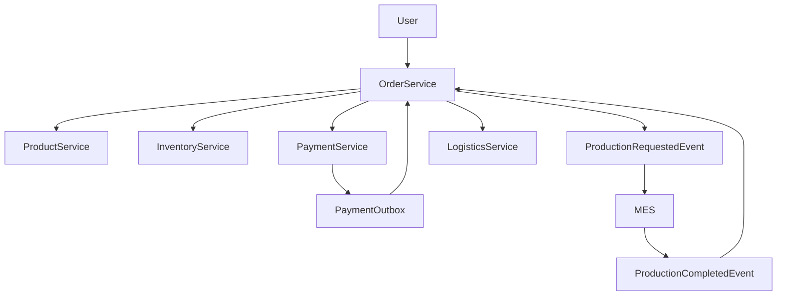
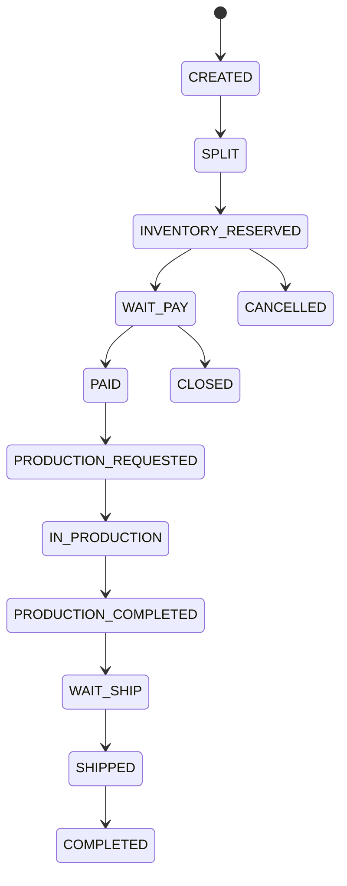

# Commerce Business Flow Blueprint

本文档记录订单、支付、库存、产品价格、MES、物流之间的整体业务流程，用于后续按模块逐步实现。

## 1. 总体业务目标

当前项目要模拟一个偏生产制造型的商业业务：

- 用户下单时，一个订单可能包含多个零件。
- 下单阶段先完成拆单、价格快照、BOM 需求快照。
- 下单后按订单号锁定库存里的原材料。
- 用户统一支付一笔总订单金额。
- 支付成功后，系统通知 MES 使用库存锁定凭证进行原材料出库，并创建生产任务。
- MES 生产完成后回传成品料号。
- 系统收到生产完成事件后触发物流发货。
- 后续需要支持个别零件退款，因此支付流水和退款流水需要支持分摊。

## 2. 核心原则

### 2.1 总订单统一收款

用户支付只发生一次，所以第三方支付流水只应该有一笔。

```text
checkout_order -> payment_order
```

即使订单内部拆成多个零件/子订单，也不应该拆成多笔假的支付流水。

### 2.2 子订单通过分摊表表达金额

拆单后的金额归属通过支付分摊表表达。

```text
payment_order
  -> payment_allocation(sub_order_id = A)
  -> payment_allocation(sub_order_id = B)
```

退款同理：

```text
payment_refund
  -> payment_refund_allocation(sub_order_id = A)
```

### 2.3 下单锁库存，支付成功后出库生产

下单时锁定原材料，但不真实出库。

```text
下单 -> inventory_reservation
```

支付成功后才通知 MES 使用锁定凭证进行原材料出库和生产。

```text
支付成功 -> ProductionRequestedEvent -> MES
```

### 2.4 跨服务事件必须可靠

本服务状态变更后要通知其他服务时，应使用 Outbox Pattern。

例如支付成功：

```text
payment_order = TRADE_SUCCESS
payment_outbox_event = PAYMENT_PAID
```

两者在同一个本地事务提交。事务提交后立即尝试投递 MQ；失败则由 relay 定时补偿。

## 3. 总体流程



详细流程：

1. 用户提交订单。
2. 订单服务创建总订单 `checkout_order`。
3. 订单服务根据商品/零件拆出 `sub_order` 和 `order_item`。
4. 订单服务调用产品服务获取价格快照和 BOM。
5. 订单服务固化 `order_bom_requirement`。
6. 订单服务调用库存服务按订单号锁定原材料。
7. 库存服务生成 `inventory_reservation` 和 `inventory_reservation_item`。
8. 订单进入 `WAIT_PAY`。
9. 支付服务创建 `payment_order`，对应这笔总订单支付。
10. 用户完成支付。
11. 支付服务确认支付成功，写 `payment_outbox_event`。
12. Outbox relay 发布 `PaymentPaidEvent`。
13. 订单服务消费支付成功事件，订单进入 `PAID`。
14. 订单服务发送 `ProductionRequestedEvent` 给 MES。
15. MES 使用库存锁定凭证进行原材料出库并创建生产任务。
16. MES 生产完成后回传 `ProductionCompletedEvent`，包含成品料号。
17. 订单服务记录生产完成信息，触发物流发货。

## 4. 服务职责

### 4.1 Product Service

负责商品/零件价格和 BOM。

后续应提供：

- 批量价格查询。
- 商品/SKU 信息查询。
- BOM 查询。
- 价格快照数据。

### 4.2 Order Service

负责订单主流程和跨服务编排。

后续应负责：

- 创建总订单。
- 拆分子订单/零件订单。
- 固化订单项价格快照。
- 固化 BOM 需求快照。
- 调用库存锁定。
- 发起支付。
- 消费支付成功事件。
- 通知 MES 开始生产。
- 接收 MES 生产完成事件。
- 触发物流发货。

### 4.3 Inventory Service

负责原材料库存和锁定凭证。

后续应负责：

- 原材料库存维护。
- 下单锁定库存。
- 支付超时释放锁定。
- 支付成功后确认锁定。
- MES 出库时生成原材料出库流水。
- 维护库存流水。

### 4.4 Payment Service

负责真实支付、退款、分摊和可靠支付事件。

当前支付侧方向：

- `payment_order`：总订单的一笔真实支付。
- `payment_allocation`：支付金额分摊到子订单/零件。
- `payment_refund`：真实退款流水。
- `payment_refund_allocation`：退款分摊到子订单/零件。
- `payment_notify_log`：支付平台回调日志。
- `payment_reconcile_record`：对账记录。
- `idempotency_record`：幂等记录。
- `payment_outbox_event`：支付事件可靠投递。

### 4.5 MES

项目内不实现 MES，只负责对接。

本项目需要：

- 发出生产请求事件。
- 接收生产完成事件。
- 保存 MES 任务 ID 和成品料号。

### 4.6 Logistics Service

后续负责发货。

当前可先只定义事件：

- `ShipmentRequestedEvent`

## 5. 订单状态机

推荐订单状态：



## 6. 库存流程

### 6.1 下单锁库存

订单服务向库存服务请求锁定原材料。

库存服务创建：

```text
inventory_reservation
inventory_reservation_item
```

库存状态变化：

```text
available_quantity -= quantity
reserved_quantity += quantity
on_hand_quantity 不变
```

### 6.2 支付成功后确认锁定

支付成功后订单服务通知 MES。

MES 使用库存锁定凭证发起原材料出库。

库存服务可将锁定状态从：

```text
RESERVED -> CONFIRMED
```

### 6.3 MES 出库

MES 创建生产任务时，使用锁定凭证进行出库。

库存状态变化：

```text
on_hand_quantity -= quantity
reserved_quantity -= quantity
```

同时写库存流水：

```text
inventory_ledger
```

### 6.4 支付超时释放

支付关闭后：

```text
reserved_quantity -= quantity
available_quantity += quantity
reservation -> RELEASED
```

## 7. 支付流程

### 7.1 预支付

订单服务调用支付服务创建总订单支付单。

```text
checkout_order_id -> payment_order
```

### 7.2 支付成功

支付服务收到支付宝回调或主动查单确认成功后：

```text
payment_order.status = TRADE_SUCCESS
payment_outbox_event.event_type = PAYMENT_PAID
```

事务提交后：

```text
afterCommit -> 立即尝试发 MQ
失败 -> relay 定时补偿
```

### 7.3 支付分摊

未来订单服务提供子订单分摊明细后，支付服务写：

```text
payment_allocation
```

示例：

```text
总订单实付 180
  子订单 A 分摊 108
  子订单 B 分摊 72
```

## 8. 退款流程

退款基于真实支付流水：

```text
payment_refund -> payment_order
```

退款对子订单的影响通过：

```text
payment_refund_allocation
```

示例：

```text
只退子订单 A:
payment_refund.refund_amount = 108
payment_refund_allocation.sub_order_id = A
payment_refund_allocation.refund_paid_amount = 108
```

## 9. 推荐数据模型

### 9.1 Order Service

建议新增：

- `checkout_order`
- `sub_order`
- `order_item`
- `order_bom_requirement`
- `order_production`

### 9.2 Inventory Service

建议新增：

- `material_stock`
- `inventory_reservation`
- `inventory_reservation_item`
- `material_outbound_order`
- `inventory_ledger`

### 9.3 Payment Service

已按方向准备：

- `payment_order`
- `payment_allocation`
- `payment_refund`
- `payment_refund_allocation`
- `payment_notify_log`
- `payment_reconcile_record`
- `idempotency_record`
- `payment_outbox_event`

## 10. 推荐事件

### 10.1 库存相关

- `InventoryReservedEvent`
- `InventoryReservationFailedEvent`
- `InventoryReleasedEvent`
- `InventoryOutboundCompletedEvent`

### 10.2 支付相关

- `PaymentPaidEvent`
- `PaymentClosedEvent`
- `PaymentRefundSucceededEvent`
- `PaymentRefundFailedEvent`

### 10.3 生产相关

- `ProductionRequestedEvent`
- `ProductionCompletedEvent`
- `ProductionFailedEvent`

### 10.4 物流相关

- `ShipmentRequestedEvent`
- `ShipmentCreatedEvent`
- `ShipmentDeliveredEvent`

## 11. 推荐实施顺序

### 第一阶段：订单模型

实现：

- `checkout_order`
- `sub_order`
- `order_item`
- `order_bom_requirement`

目标：订单服务能表达总订单、零件子订单、价格快照和 BOM 快照。

### 第二阶段：库存锁定

实现：

- `material_stock`
- `inventory_reservation`
- `inventory_reservation_item`
- `inventory_ledger`

目标：下单时能按订单号锁定原材料。

### 第三阶段：支付联动

实现：

- 支付接口统一使用 `checkoutOrderId`
- 预支付时写 `payment_order`
- 后续根据订单拆单结果写 `payment_allocation`

目标：总订单统一支付，支付成功可靠通知订单。

### 第四阶段：MES 对接

实现：

- `ProductionRequestedEvent`
- MES 回调/监听 `ProductionCompletedEvent`
- `order_production`

目标：支付成功后通知 MES，MES 完成后回传成品料号。

### 第五阶段：物流发货

实现：

- `ShipmentRequestedEvent`
- 物流服务创建发货单

目标：生产完成后自动触发发货流程。

### 第六阶段：退款和售后

实现：

- 子订单维度退款
- `payment_refund_allocation`
- 退款影响库存/生产/物流的状态判断

目标：支持单个零件退款和金额分摊。

## 12. 当前项目状态

当前代码中：

- 支付服务已经朝总订单支付和分摊模型演进。
- 订单服务仍是简化单商品模型，需要优先升级。
- 库存服务仍是 demo 校验逻辑，需要优先实现库存锁定凭证。
- 产品服务仍是固定价格，需要补价格和 BOM 能力。

因此下一步推荐先做订单服务和库存服务的基础模型，而不是继续深入支付细节。
