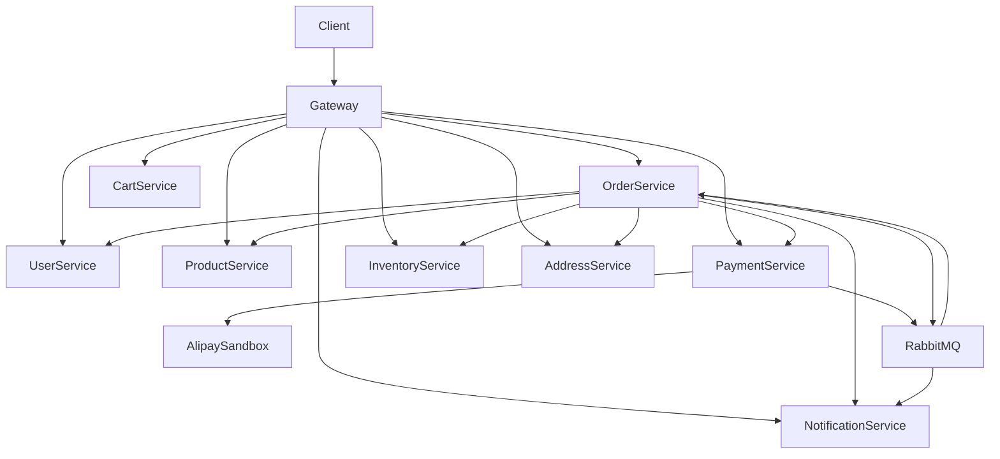

# Commerce Demo

`psj-demo` is a Spring Boot microservice demo for a commerce domain. It covers authentication, RBAC, product and address data, cart data, multi-item checkout orders, inventory reservation, Alipay sandbox payment, payment allocation, refund allocation, reconciliation, notification records, fulfillment APIs, and a Gateway entry point.

The current implementation does not include Elasticsearch or GraphQL. PostgreSQL remains the source of truth for business data.

## Modules

| Module | Description |
| --- | --- |
| `commerce-contracts` | Shared DTOs, security headers/constants, MQ topology, payment request DTOs, and messaging contracts. |
| `commerce-gateway` | Spring Cloud Gateway entry point, Sa-Token validation, path-based permission checks, and user context propagation. |
| `commerce-user-service` | User profile, registration, login, credentials, Sa-Token session data, RBAC roles and permissions. |
| `commerce-product-service` | Product CRUD and product price/SKU lookup. |
| `commerce-order-service` | Checkout order orchestration, sub-orders, order state transitions, refund requests, order outbox, payment event handling, and fulfillment APIs. |
| `commerce-inventory-service` | Warehouses, bins, balances, stock reservation, reservation binding, release, confirmation, inventory ledgers, and inventory receipts. |
| `commerce-payment-service` | Alipay sandbox pre-create/query/notify/close/refund, payment allocations, refund allocations, payment outbox, active query compensation, and reconciliation. |
| `commerce-notification-service` | Notification records and simulated LOG-channel notifications. |
| `commerce-address-service` | Address CRUD and default-address support. |
| `commerce-cart-service` | Shopping cart item persistence and cart management APIs. |

## Tech Stack

- Java 17
- Spring Boot 3.2
- Spring Cloud Gateway
- Spring Cloud OpenFeign
- Spring Cloud Alibaba Nacos service discovery
- PostgreSQL
- Redis
- RabbitMQ
- Flyway
- MyBatis Dynamic SQL
- Sa-Token
- Maven Wrapper
- Docker Compose
- Kubernetes manifests for local Docker Desktop Kubernetes

## Architecture

The project uses one Spring Boot service per business domain. Cross-service synchronous calls use OpenFeign over Nacos service discovery. Cross-service side effects that must be retried use the Outbox Pattern.



Important boundaries:

- Business databases are independent per service.
- The Gateway exposes `/api/**`; service-to-service endpoints use `/internal/**`.
- Alipay notify is the only `/api/payments/**` path intentionally allowed without `satoken`.
- Payment and order events are eventually consistent through outbox tables and RabbitMQ.

## Business Model

### Checkout Order Model

The order side uses a checkout-order plus sub-order model:

```text
orders
  -> order_sub_orders
  -> order_items
  -> order_inventory_reservations
  -> order_refund_requests
  -> order_status_logs
  -> order_outbox_events
```

`orders` is the checkout order. `order_sub_orders` represents each product/SKU line. `order_items` stores item snapshots for historical display. `order_inventory_reservations` stores reservation IDs returned by inventory. `order_refund_requests` is the order-side refund business request table.

### Payment Model

Payment is modeled as one real third-party payment per checkout order, with allocation rows for sub-orders:

```text
payment_order
  -> payment_allocation
  -> payment_refund
      -> payment_refund_allocation
```

The third-party channel sees one total payment. Internal allocation tables express how that payment amount belongs to each sub-order.

### Inventory Model

Inventory uses warehouse/bin balances and reservation rows:

```text
inv_balances
inv_bin_balances
inv_reservations
inv_transactions
inv_warehouse_ledgers
inv_bin_ledgers
```

Order creation reserves inventory first. A reserved row starts as `bound_order=false` with a short orphan TTL. After the order transaction commits, the order service binds the reservation. Bound reservations are then confirmed or released by order outbox events.

## Complete Order, Inventory, and Payment Flow

### 1. Create Order

Entry point:

```text
POST /api/orders
```

The API supports the legacy single-product shape:

```json
{
  "userId": 1,
  "productId": 1,
  "addressId": 1,
  "quantity": 2
}
```

It also supports multi-item checkout:

```json
{
  "userId": 1,
  "addressId": 1,
  "items": [
    { "productId": 1, "quantity": 2 },
    { "productId": 2, "quantity": 1 }
  ]
}
```

Actual implementation:

```text
OrderController
  -> OrderApplicationService.create
  -> UserQueryPort.getUser
  -> AddressQueryPort.getAddress
  -> ProductQueryPort.getProduct for each item
  -> generate orderId/orderNo in memory
  -> reserve inventory first
  -> create order data in a local transaction
  -> bind inventory reservations
  -> pre-create payment with allocation details
```

The current order creation order is deliberate:

```text
1. Build checkout lines from request.
2. Query product price snapshots.
3. Generate orderId/orderNo, but do not insert the order yet.
4. Call inventory `reserveStock` for each SKU.
5. If reservation fails, return failure and do not create an order row.
6. In an order-service local transaction, insert:
   - `orders`
   - `order_sub_orders`
   - `order_items`
   - `order_inventory_reservations`
   - `order_status_logs`
7. Move order `CREATED -> STOCK_RESERVED -> WAIT_PAY`.
8. Move sub-orders to `WAIT_PAY`.
9. Commit the local transaction.
10. Call inventory `bindReservations`.
11. Call payment `precreate-detailed`.
12. If payment pre-create succeeds, write order outbox events for wait-pay notification.
13. If payment pre-create fails, mark the order `FAILED` and write inventory release outbox.
```

Key files:

- `commerce-order-service/src/main/java/com/commerce/order/application/service/OrderApplicationService.java`
- `commerce-order-service/src/main/java/com/commerce/order/domain/service/OrderDomainService.java`
- `commerce-order-service/src/main/java/com/commerce/order/infrastructure/rpc/InventoryClient.java`
- `commerce-order-service/src/main/java/com/commerce/order/infrastructure/rpc/PaymentClient.java`

### 2. Inventory Reservation and Binding

Order service calls:

```text
POST /internal/inventory/reserve
```

Inventory service:

```text
InventoryApplicationService.reserveStock
  -> choose bins with available quantity
  -> lock stock
  -> create `inv_reservations`
  -> set `available_to = now + inventory.reservation-orphan-ttl-seconds`
  -> return reservationIds
```

Default orphan TTL:

```text
inventory.reservation-orphan-ttl-seconds = 60
inventory.reservation-expire-delay-ms = 10000
```

Reservation binding:

```text
POST /internal/inventory/reservations/bind
```

Binding sets:

```text
bound_order = true
available_to = null
```

If an order is not created successfully after inventory reservation, the reservation remains unbound. The inventory service periodically releases unbound expired reservations:

```text
bound_order = false
AND available_to <= now
AND remaining > 0
AND cancelled_time IS NULL
```

This protects inventory from being locked forever when the order service fails after a successful remote reservation but before order persistence.

Key files:

- `commerce-inventory-service/src/main/java/com/commerce/inventory/application/service/InventoryApplicationService.java`
- `commerce-inventory-service/src/main/java/com/commerce/inventory/interfaces/rest/InternalInventoryController.java`
- `commerce-inventory-service/src/main/resources/db/migration/V3__add_reservation_binding_ttl.sql`

### 3. Payment Pre-Create and Allocation

Order service calls:

```text
POST /internal/payments/precreate-detailed
```

DTOs:

- `commerce-contracts/src/main/java/com/commerce/payment/PreCreatePaymentRequest.java`
- `commerce-contracts/src/main/java/com/commerce/payment/PaymentAllocationRequest.java`

Payment request shape:

```text
checkoutOrderId
totalAmount
subject
allocations[]
```

Each allocation maps a sub-order to its paid amount:

```text
subOrderId
merchantId
goodsAmount
shippingAmount
platformDiscountAmount
merchantDiscountAmount
paidAmount
settleAmount
```

Payment service behavior:

```text
PaymentApplicationService.preCreate
  -> validate request
  -> if existing paid order, return PAID
  -> if existing waiting order, return outTradeNo
  -> create `payment_order`
  -> create `payment_allocation`
  -> call `AlipaySandboxClient.precreate`
  -> save tradeNo and raw response
  -> return WAIT_BUYER_PAY:outTradeNo:qrCode
```

Key files:

- `commerce-payment-service/src/main/java/com/commerce/payment/application/service/PaymentApplicationService.java`
- `commerce-payment-service/src/main/java/com/commerce/payment/infrastructure/alipay/AlipaySandboxClient.java`
- `commerce-payment-service/src/main/java/com/commerce/payment/infrastructure/persistence/PaymentAllocationRepository.java`

### 4. Payment Result

Payment can be confirmed by Alipay notify or active query.

Alipay notify:

```text
POST /api/payments/notify
```

The Gateway explicitly allows this path without `satoken`.

Notify handling:

```text
PaymentController.notifyAlipay
  -> PaymentApplicationService.handleNotify
  -> verify Alipay RSA2 signature
  -> write `payment_notify_log`
  -> dedupe by `notify:{notify_id}`
  -> update `payment_order`
  -> if TRADE_SUCCESS, write payment outbox `PAYMENT_PAID`
  -> after commit, try publishing RabbitMQ event
```

Active query compensation:

```text
PaymentActiveQueryScheduler
  -> query WAIT_BUYER_PAY payment orders
  -> PaymentApplicationService.query
  -> if channel status is success, write the same payment outbox event
```

Payment outbox:

```text
payment_order = TRADE_SUCCESS
payment_outbox_event = PAYMENT_PAID
```

Both are written in the same payment-service local transaction. If RabbitMQ publish fails, `PaymentOutboxRelay` retries.

Key files:

- `commerce-payment-service/src/main/java/com/commerce/payment/application/service/PaymentOutboxRelay.java`
- `commerce-payment-service/src/main/java/com/commerce/payment/infrastructure/mq/PaymentEventPublisher.java`
- `commerce-payment-service/src/main/java/com/commerce/payment/application/service/PaymentActiveQueryScheduler.java`

### 5. Payment Paid Event Consumed by Order

RabbitMQ event:

```text
PaymentPaidEvent(orderId, outTradeNo, tradeNo, amount)
```

Order service listener:

```text
PaymentPaidListener.onPaymentPaid
```

Normal case:

```text
WAIT_PAY -> PAID
sub-orders -> PAID
write ORDER_PAID outbox
write INVENTORY_CONFIRM_REQUESTED outbox
write NOTIFICATION_REQUESTED outbox
```

If the order is already `PAID` or `COMPLETED`, the event is ignored.

If the order is already `CANCELLED` or `FAILED`, the event is treated as a late payment:

```text
CANCELLED/FAILED + payment.paid
  -> REFUND_REQUIRED
  -> create `order_refund_requests`
  -> write REFUND_REQUESTED outbox
```

Key file:

- `commerce-order-service/src/main/java/com/commerce/order/infrastructure/mq/PaymentPaidListener.java`

### 6. Inventory Confirmation After Payment

Order outbox event:

```text
INVENTORY_CONFIRM_REQUESTED
```

Handled by:

```text
OrderOutboxRelay.confirmInventory
```

Flow:

```text
PAID -> INVENTORY_CONFIRMING
call inventory `confirmStock(reservationIds)`
inventory outbound consumes locked stock
INVENTORY_CONFIRMING -> WAIT_SHIP
```

Inventory confirmation is an outbound operation. It consumes remaining reserved quantity and writes inventory ledgers.

If inventory confirmation fails, the order can enter `INVENTORY_CONFIRM_FAILED`, and the outbox event is marked failed for retry/inspection.

### 7. Cancel, Timeout, and Payment Pre-Create Failure

Manual cancel:

```text
DELETE /api/orders/{orderId}
```

Order timeout:

```text
OrderTimeoutCancellationService.cancelTimedOutOrders
```

Default:

```text
order.payment-timeout-minutes = 30
order.timeout-scan-delay-ms = 60000
```

Cancel/timeout writes outbox events:

```text
ORDER_CANCELLED
NOTIFICATION_REQUESTED
INVENTORY_RELEASE_REQUESTED
PAYMENT_CLOSE_REQUESTED
```

Payment pre-create failure also marks the order `FAILED` and writes `INVENTORY_RELEASE_REQUESTED`.

Inventory release:

```text
OrderOutboxRelay.releaseInventory
  -> inventory releaseStock
  -> unlock stock
  -> cancel reservations
```

Payment close:

```text
OrderOutboxRelay.closePayment
  -> payment close
  -> Alipay alipay.trade.close
```

Key files:

- `commerce-order-service/src/main/java/com/commerce/order/application/service/OrderOutboxRelay.java`
- `commerce-order-service/src/main/java/com/commerce/order/application/service/OrderTimeoutCancellationService.java`

### 8. Refunds

Manual refund entry point:

```text
POST /api/orders/{orderId}/refund
```

Request:

```json
{
  "subOrderId": 123,
  "amount": 50.00,
  "reason": "customer_refund"
}
```

If `subOrderId` is omitted, the request is treated as an order-level refund. If `subOrderId` is present, it is a sub-order refund.

Order service:

```text
create `order_refund_requests`
update sub-order refundStatus when needed
write REFUND_REQUESTED outbox
```

Order outbox calls:

```text
POST /internal/payments/refund-detailed
```

DTOs:

- `commerce-contracts/src/main/java/com/commerce/payment/RefundPaymentRequest.java`
- `commerce-contracts/src/main/java/com/commerce/payment/RefundAllocationRequest.java`

Payment service refund behavior:

```text
PaymentApplicationService.refund
  -> payment order must be TRADE_SUCCESS
  -> derive stable outRefundNo from refundRequestId
  -> dedupe by `refund:{outRefundNo}`
  -> validate cumulative refund amount <= allocation paidAmount
  -> call Alipay alipay.trade.refund
  -> write `payment_refund`
  -> write `payment_refund_allocation`
```

On success, order outbox updates:

```text
order_refund_requests.status = REFUNDED
sub-order refundStatus = REFUNDED
REFUND_REQUIRED order -> REFUNDED
```

### 9. Reconciliation

Entry point:

```text
POST /api/payments/reconcile?billDate=2026-06-29
```

Flow:

```text
PaymentApplicationService.reconcile
  -> Alipay bill download URL query
  -> upsert `payment_reconcile_record`
  -> PaymentReconcileService.reconcile
  -> AlipayBillDownloader downloads CSV/ZIP
  -> AlipayBillParser parses bill lines
  -> insert `payment_reconcile_detail`
  -> compare channel lines with local `payment_order` and `payment_refund`
  -> insert `payment_reconcile_diff`
```

Diff types:

```text
LOCAL_ONLY
CHANNEL_ONLY
AMOUNT_MISMATCH
STATUS_MISMATCH
```

Reconciliation records differences only. It does not automatically mutate payment or order status.

Key files:

- `commerce-payment-service/src/main/java/com/commerce/payment/application/service/reconcile/PaymentReconcileService.java`
- `commerce-payment-service/src/main/java/com/commerce/payment/application/service/reconcile/AlipayBillDownloader.java`
- `commerce-payment-service/src/main/java/com/commerce/payment/application/service/reconcile/AlipayBillParser.java`

## State Machines

### Main Order States

```text
CREATED
-> STOCK_RESERVED
-> WAIT_PAY
-> PAID
-> INVENTORY_CONFIRMING
-> WAIT_SHIP
-> SHIPPED
-> RECEIVED
-> COMPLETED
```

### Failure and Compensation States

```text
WAIT_PAY -> CANCELLED
WAIT_PAY -> FAILED
PAID -> INVENTORY_CONFIRMING -> INVENTORY_CONFIRM_FAILED
CANCELLED/FAILED + payment.paid -> REFUND_REQUIRED -> REFUNDED
```

### Payment States

```text
WAIT_BUYER_PAY
TRADE_SUCCESS
TRADE_CLOSED
TRADE_FAILED
```

Alipay mapping:

```text
TRADE_SUCCESS / TRADE_FINISHED -> TRADE_SUCCESS
TRADE_CLOSED -> TRADE_CLOSED
others -> WAIT_BUYER_PAY
```

### Inventory Reservation Lifecycle

```text
reserveStock
  -> inv_reservations.remaining > 0
  -> bound_order = false
  -> available_to = now + 60 seconds

bindReservations
  -> bound_order = true
  -> available_to = null

payment success
  -> confirmStock
  -> outbound consumes remaining quantity

cancel/timeout/failure
  -> releaseStock
  -> unlocks stock and cancels reservations

unbound reservation timeout
  -> expireUnboundReservations
  -> releaseStock(orderId=0)
```

## Consistency Strategy

The project does not use XA or Seata. It uses business-level final consistency.

### Order and Inventory

The important rule is:

```text
Inventory is reserved before order rows are created.
If stock cannot be reserved, no order is inserted.
```

The risk window is:

```text
inventory reservation succeeds
order service fails before order rows are committed
```

That window is handled by inventory-owned orphan TTL:

```text
unbound reservation
available_to <= now
remaining > 0
-> inventory service releases it automatically
```

After the order is committed, the order service binds reservations. Bound reservations are no longer controlled by orphan TTL. They are controlled by order outbox events.

### Order and Payment

Payment success is propagated by payment outbox:

```text
payment_order status update
payment_outbox_event insert
```

Both happen in one local payment transaction. RabbitMQ publish is retried by `PaymentOutboxRelay`.

### Payment Success and Inventory Confirmation

Order service consumes `PaymentPaidEvent` and writes order outbox:

```text
INVENTORY_CONFIRM_REQUESTED
NOTIFICATION_REQUESTED
```

The inventory confirmation call is retried by `OrderOutboxRelay`.

### Cancel/Timeout/Failure and Inventory Release

Order cancel, payment timeout, and payment pre-create failure all write:

```text
INVENTORY_RELEASE_REQUESTED
```

The release is retried by order outbox. If the order never existed because creation failed before persistence, inventory orphan TTL handles it.

### Idempotency

Important idempotency keys and guards:

- `notify:{notify_id}` for Alipay notify.
- `payment-paid:{outTradeNo}` for payment success outbox.
- `refund:{outRefundNo}` for refunds.
- `order_outbox_events.event_key` for order side effects.
- Order status updates use expected status and `orders.version`.
- Inventory reservation operations check `remaining`, `cancelled_time`, and consume/release state.

## Notification Flow

Notification service is a LOG-channel simulation. It writes `notification_records` and marks them `SENT`; it does not send real SMS or email.

Wait-pay notification can be produced by two paths:

```text
ORDER_WAIT_PAY outbox -> Rabbit OrderCreatedEvent -> OrderCreatedListener
NOTIFICATION_REQUESTED outbox -> Feign internal notification API
```

Paid and cancelled notifications are mainly driven by order outbox Feign calls:

```text
NOTIFICATION_REQUESTED(ORDER_PAID)
NOTIFICATION_REQUESTED(ORDER_CANCELLED)
```

## Gateway and Authentication

Gateway routes are defined in:

```text
commerce-gateway/src/main/resources/application.yml
```

The Gateway filter:

```text
commerce-gateway/src/main/java/com/commerce/gateway/security/GatewayAuthFilter.java
```

Rules:

- `/api/auth/login` and `/api/auth/register` are public.
- `/api/payments/notify` is public for Alipay callbacks.
- Other `/api/**` paths require the `satoken` header.
- Gateway reads Sa-Token session data from Redis and forwards:
  - `X-User-Id`
  - `X-Username`
  - `X-Roles`
  - `X-Permissions`
- Permission checks are path-prefix based.

## Public APIs

### Auth

```text
POST /api/auth/register
POST /api/auth/login
```

### Products

```text
POST   /api/products
PUT    /api/products/{productId}
DELETE /api/products/{productId}
GET    /api/products
GET    /api/products/{productId}
GET    /api/products/{productId}/price
```

### Addresses

```text
POST   /api/addresses
PUT    /api/addresses/{addressId}
DELETE /api/addresses/{addressId}
GET    /api/addresses
GET    /api/addresses/{addressId}
GET    /api/addresses/{userId}/default
```

### Cart

```text
POST   /api/carts/items
PUT    /api/carts/items/{itemId}
DELETE /api/carts/items/{itemId}?userId={userId}
DELETE /api/carts?userId={userId}
GET    /api/carts
GET    /api/carts/items/{itemId}
```

### Orders

```text
POST   /api/orders
GET    /api/orders
GET    /api/orders/{orderId}
DELETE /api/orders/{orderId}
POST   /api/orders/{orderId}/refund
POST   /api/orders/{orderId}/ship
POST   /api/orders/{orderId}/receive
POST   /api/orders/{orderId}/complete
```

Create a multi-item order:

```bash
curl -X POST http://localhost:8080/api/orders \
  -H 'Content-Type: application/json' \
  -H 'satoken: <token>' \
  -d '{
    "userId": 1,
    "addressId": 1,
    "items": [
      { "productId": 1, "quantity": 2 },
      { "productId": 2, "quantity": 1 }
    ]
  }'
```

Create a sub-order refund request:

```bash
curl -X POST http://localhost:8080/api/orders/10001/refund \
  -H 'Content-Type: application/json' \
  -H 'satoken: <token>' \
  -d '{
    "subOrderId": 20001,
    "amount": 20.00,
    "reason": "customer_refund"
  }'
```

### Payments

```text
POST /api/payments/pay
POST /api/payments/precreate
POST /api/payments/notify
POST /api/payments/refund
POST /api/payments/close
GET  /api/payments/query
POST /api/payments/reconcile
POST /api/payments/mock
```

`/api/payments/mock` only pre-creates a hard-coded `orderId=1` payment; it does not simulate payment success.

### Inventory

Inventory APIs cover warehouses, bins, balances, locks, unlocks, inbound/outbound, adjustments, and receipt workflows under:

```text
/api/inventory/**
```

Order-specific inventory integration uses internal endpoints under:

```text
/internal/inventory/**
```

### Notifications

```text
POST /api/notifications/mock
POST /api/notifications/order-paid
POST /api/notifications/order-wait-pay
POST /api/notifications/order-cancelled
```

## Internal APIs

Internal APIs are used by Feign clients and are not routed by the Gateway.

Important internal endpoints:

```text
POST /internal/inventory/reserve
POST /internal/inventory/reservations/bind
POST /internal/inventory/release
POST /internal/inventory/confirm

POST /internal/payments/precreate
POST /internal/payments/precreate-detailed
GET  /internal/payments/query
POST /internal/payments/refund
POST /internal/payments/refund-detailed
POST /internal/payments/close

POST /internal/notifications/order-paid
POST /internal/notifications/order-wait-pay
POST /internal/notifications/order-cancelled
```

## Important Configuration

| Property | Default | Service | Description |
| --- | --- | --- | --- |
| `inventory.reservation-orphan-ttl-seconds` | `60` | Inventory | TTL for unbound stock reservations created before an order is persisted. |
| `inventory.reservation-expire-delay-ms` | `10000` | Inventory | Scheduler delay for releasing expired unbound reservations. |
| `order.payment-timeout-minutes` | `30` | Order | Timeout for orders waiting for payment. |
| `order.timeout-scan-delay-ms` | `60000` | Order | Scheduler delay for order payment timeout scans. |
| `order.outbox-relay-delay-ms` | `5000` | Order | Scheduler delay for order outbox retry. |
| `payment.order-timeout-minutes` | `30` | Payment | Timeout for payment-side close scan. |
| `payment.close-scan-delay-ms` | `60000` | Payment | Scheduler delay for closing timed-out payment orders. |
| `payment.active-query-delay-ms` | `60000` | Payment | Scheduler delay for active Alipay query compensation. |
| `payment.outbox-relay-delay-ms` | `5000` | Payment | Scheduler delay for payment outbox retry. |

Alipay sandbox credentials are externalized:

```text
ALIPAY_GATEWAY_URL
ALIPAY_APP_ID
ALIPAY_APP_PRIVATE_KEY
ALIPAY_PUBLIC_KEY
ALIPAY_NOTIFY_URL
```

## Local Requirements

Install or start the following before running the project:

- JDK 17
- Docker Desktop or Docker Engine
- Docker Compose plugin for Docker Compose startup
- Docker Desktop Kubernetes and `kubectl` for Kubernetes startup

The repository uses Maven Wrapper, so a local Maven installation is not required.

## Quick Start

Build all runnable jars first:

```bash
./mvnw -DskipTests package
```

Start the full local `dev` environment with Docker Compose:

```bash
bash scripts/deploy/up-all.sh dev
```

Stop the Docker Compose environment:

```bash
bash scripts/deploy/down-all.sh dev
```

The startup script launches infrastructure and all business services. It also creates per-service PostgreSQL containers through each module's Docker Compose file.

## Kubernetes Startup

The local Kubernetes deployment is intended for Docker Desktop Kubernetes. Enable Kubernetes in Docker Desktop first, then make sure `kubectl config current-context` points to `docker-desktop`.

Build the local Docker images after packaging the jars:

```powershell
.\scripts\k8s\build-images.ps1
```

Start the local Kubernetes environment:

```powershell
.\scripts\k8s\up.ps1
```

The script applies `deploy/k8s` into the `commerce-dev` namespace and waits for Nacos, Redis, RabbitMQ, seven PostgreSQL instances, and all application deployments to become ready.

Access the gateway through the NodePort service:

```powershell
curl http://localhost:30080/api/products
```

Stop and remove the local Kubernetes environment:

```powershell
.\scripts\k8s\down.ps1
```

## Infrastructure

The shared infrastructure stack is defined in:

```text
deploy/infra/docker-compose.yml
```

Default `dev` ports:

| Component | Port |
| --- | --- |
| Nacos | `8848` |
| Redis | `6379` |
| RabbitMQ | `5672` |
| RabbitMQ Management | `15672` |

The `up-all.sh` script also starts module-level databases. In `dev`, database ports start from `15431`.

## Service Ports

Default `dev` application ports:

| Service | Port |
| --- | --- |
| Gateway | `8080` |
| Order | `8081` |
| Inventory | `8082` |
| User | `8083` |
| Product | `8084` |
| Payment | `8085` |
| Notification | `8086` |
| Address | `8087` |
| Cart | `8088` |

Other environments use an offset:

- `test`: app ports add `10000`
- `prod`: app ports add `20000`

## Run One Service Locally

You can run a single module from the IDE or terminal after starting its dependencies.

Example:

```bash
./mvnw -pl commerce-user-service -am spring-boot:run
```

For local non-Docker runs, services expect default local dependency addresses:

- PostgreSQL: `localhost:5432`
- Redis: `localhost:6379`
- Nacos: `localhost:8848`

## Authentication Flow

Register:

```bash
curl -X POST http://localhost:8080/api/auth/register \
  -H 'Content-Type: application/json' \
  -d '{
    "firstName": "Demo",
    "secondName": "User",
    "phone": "13800009999",
    "email": "demo.user@example.com",
    "username": "demo_user",
    "password": "123456"
  }'
```

Login:

```bash
curl -X POST http://localhost:8080/api/auth/login \
  -H 'Content-Type: application/json' \
  -d '{"username":"customer","password":"123456"}'
```

The response contains a Sa-Token token. Send it in later requests with the `satoken` header:

```bash
curl http://localhost:8080/api/users/1 \
  -H 'satoken: <token>'
```

Login state is stored by Sa-Token in Redis. The token session stores:

- `userId`
- `username`
- `roles`
- `permissions`

RBAC data is managed by the user service:

- `roles`
- `permissions`
- `user_roles`
- `role_permissions`
- `user_credentials`

Management APIs are exposed under:

- `/api/rbac/roles`
- `/api/rbac/permissions`
- `/api/rbac/user-roles`
- `/api/rbac/role-permissions`

Changing user roles, role permissions, roles, permissions, passwords, or login status logs out affected users so their next login reloads fresh permissions.

## Common Commands

Compile all modules:

```bash
./mvnw -DskipTests compile
```

Run tests:

```bash
./mvnw test
```

Package all modules:

```bash
./mvnw -DskipTests package
```

Apply formatting:

```bash
./mvnw spotless:apply
```

Install Git hooks:

```bash
bash scripts/install-git-hooks.sh
```

## Notes

- Flyway migrations run automatically when services start.
- Product, address, order, payment, inventory, notification, and cart data are persisted with PostgreSQL.
- Order IDs are internal numeric identifiers. `order_no` is the external business order number.
- Orders store product and address snapshots so historical orders are not affected by later product price or address changes.
- Order state changes are guarded by optimistic locking with the `orders.version` column.
- Gateway routes `/api/auth/**`, `/api/users/**`, and `/api/rbac/**` to `commerce-user-service`.
- `/api/auth/login`, `/api/auth/register`, and `/api/payments/notify` are public. Other `/api/**` requests require a valid `satoken` header.
- Current gateway permission checks are path-based. Service-level method authorization can be added later with annotations if finer authorization is needed.
- JDK 17 must be available through a valid `JAVA_HOME` before running Maven Wrapper commands.
